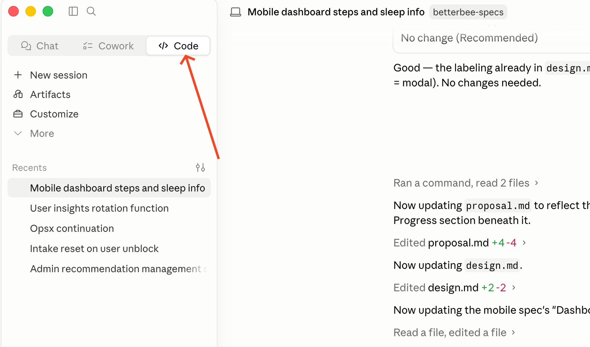
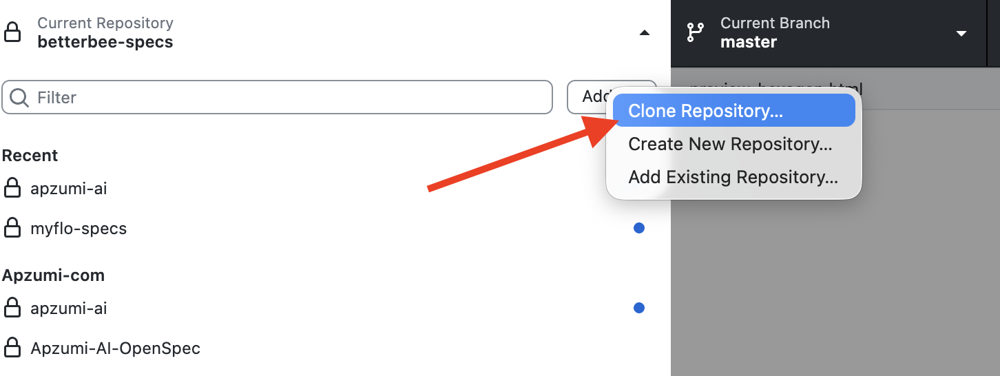
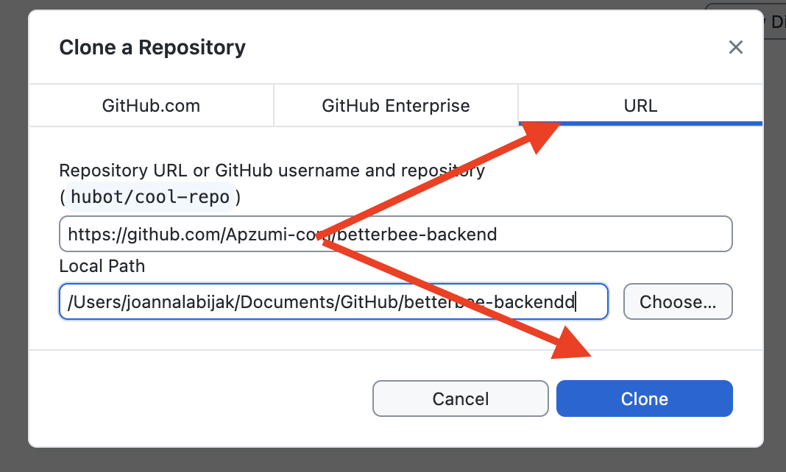
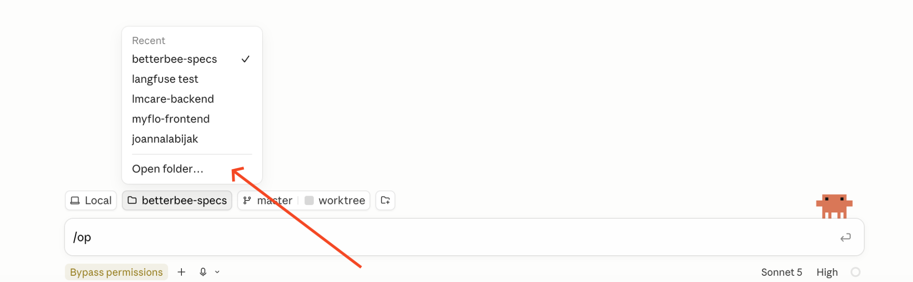
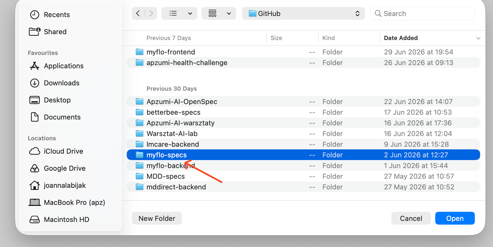
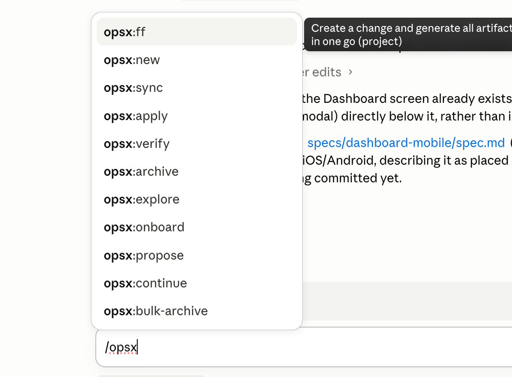

# Setting up Claude Code, OpenSpec, and your project's specs repository

End-to-end setup for project managers, business analysts, product owners, and delivery leads: from a machine with nothing installed to a specs repository that is ready for its first documented change.

Work through it once, in order. Expect **45–60 minutes** the first time, most of it waiting on downloads.

Commands are given for **macOS** and **Windows**. Where they differ, both are shown — run the one for your machine. On Windows you can also install [Git for Windows](https://git-scm.com/downloads/win) and use **Git Bash**, in which every macOS command in this guide works verbatim; Git for Windows is recommended anyway, because it gives Claude Code its Bash tool.

## What you are building

A **specs repository** — one repository per project, holding the OpenSpec documentation, with the project's **code repositories attached to it as git submodules**:

```text
myproject-specs/            ← the repository you set up here
├── openspec/               ← the documentation: conventions, specs, changes
├── submodules/
│   ├── backend/            ← the real backend repository
│   └── frontend/           ← the real frontend repository
└── .claude/                ← the instructions and commands Claude Code follows
```

That layout is the point of the whole exercise: from this single checkout, Claude Code can read the real code of every platform while writing the documentation, so a design references files that actually exist instead of plausible-sounding invented ones.

## Before you begin, have ready

- Your GitHub account name and the e-mail address it uses.
- Which code repositories the project has (backend, frontend, mobile…), and for each: its clone URL and the branch the team actually works on.
- Admin rights on your machine to install applications.

---

## Part A — Install the applications

### 1. Download and install

- **Claude Desktop** — https://claude.com/download
- **GitHub Desktop** — https://desktop.github.com/download/
- **Node.js** (needed in step 8, if you don't already have it) — https://nodejs.org/en/download
- **Windows only, recommended:** [Git for Windows](https://git-scm.com/downloads/win). It gives you Git Bash, and lets Claude Code run Bash commands rather than PowerShell.

### 2. Open Claude Desktop and go to the Code tab



### 3. Set up GitHub access over SSH

Paste the prompt below into Claude Desktop's Code tab, **with your own e-mail and GitHub login filled in**. It walks through key generation, the SSH agent, the SSH config, permissions, and the connection test, pausing for you at each step. It detects your operating system and picks the right commands.

```text
Set up SSH access to GitHub on this machine. Work through the steps in order
and show me every command before you run it.

Context:
- my GitHub e-mail: YOUR@EMAIL.COM
- my GitHub account name: YOUR_LOGIN
- operating system: detect it yourself (macOS / Windows / Linux / WSL) and
  choose the commands accordingly. On Windows tell me whether you are using
  PowerShell or Git Bash, and keep to that one throughout.

Scope:
1. Check whether keys already exist in the SSH directory (~/.ssh on
   macOS/Linux, C:\Users\<me>\.ssh on Windows) and whether any of them is
   already associated with GitHub. If one is, do NOT overwrite it — propose
   using the existing key instead.
2. If there is no key, generate a new ed25519 key with my e-mail as the
   comment, named id_ed25519_github. Do not set a passphrase yourself — if one
   is needed, stop and let me type it in myself.
3. Start the SSH agent and add the key to it:
   - macOS: ssh-add --apple-use-keychain
   - Windows: make sure the ssh-agent service is running first
     (Get-Service ssh-agent, Set-Service ssh-agent -StartupType Manual,
     Start-Service ssh-agent), then plain ssh-add
   - Linux / WSL: plain ssh-add
4. APPEND (do not overwrite!) this entry to the SSH config file:
     Host github.com
       HostName github.com
       User git
       IdentityFile ~/.ssh/id_ed25519_github
       IdentitiesOnly yes
       AddKeysToAgent yes
   If an entry for github.com already exists, show it to me and ask what to do.
5. Set the correct permissions:
   - macOS / Linux / WSL: 700 on ~/.ssh, 600 on the private key, 644 on the
     public key and the config.
   - Windows: NTFS permissions rather than chmod — the private key must be
     readable only by my own account, or ssh refuses to use it. Use icacls and
     show me what you are changing.
6. Print the contents of the public key (.pub) so I can paste it into
   GitHub → Settings → SSH and GPG keys → New SSH key.
   If I have the gh CLI installed and authenticated (check `gh auth status`),
   offer `gh ssh-key add` as an alternative, but do not run it without my
   agreement.
7. Wait for me to confirm the key is added on GitHub, then test the
   connection: ssh -T git@github.com
8. Finally, check the remotes in this repo (git remote -v). If they use HTTPS,
   show me the command that switches them to SSH, but only change them after
   I say yes.

Rules:
- never print or log the contents of the private key,
- do not modify the global git configuration without asking,
- on any error, stop and explain what went wrong.
```

Do not continue until `ssh -T git@github.com` greets you by name.

---

## Part B — Create and clone the specs repository

### 4. Create the repository on GitHub

Open GitHub in a browser and give your project a specs repository, named `<project>-specs` — for example `myflo-specs`.

Take one of the available spare repositories (a repository still named something like `Repo6`), open its **Settings**, and rename it to `<project>-specs`.

### 5. Clone it with GitHub Desktop

GitHub Desktop works the same on macOS and Windows. Choose **Add ▾ → Clone Repository…**



Open the **URL** tab, paste the address of your new repository, check the local path, and press **Clone**.



Note where it put the clone — you will need that path in step 9:

- **macOS:** typically `/Users/<you>/Documents/GitHub/<project>-specs`
- **Windows:** typically `C:\Users\<you>\Documents\GitHub\<project>-specs`

From here on, everything happens **inside this clone**. Nothing in the rest of this guide creates a repository or changes your remote.

---

## Part C — Install the command-line tools

### 6. Open a terminal

- **macOS:** press **⌘ + Space**, type `terminal`, press Enter.
- **Windows:** press the **Start** key, type `powershell` (or `terminal`), press Enter. Your prompt starts with `PS C:\` in PowerShell, and `C:\` without the `PS` in CMD — the two need different install commands below.

### 7. Install Claude Code

**macOS, Linux, WSL, or Git Bash:**

```bash
curl -fsSL https://claude.ai/install.sh | bash
```

**Windows PowerShell:**

```powershell
irm https://claude.ai/install.ps1 | iex
```

**Windows CMD:**

```batch
curl -fsSL https://claude.ai/install.cmd -o install.cmd && install.cmd && del install.cmd
```

If you see `The token '&&' is not a valid statement separator`, you are in PowerShell, not CMD. If you see `'irm' is not recognized`, you are in CMD, not PowerShell.

### 8. Install the OpenSpec CLI

The same command everywhere — it needs Node.js from step 1:

```bash
npm install -g @fission-ai/openspec@latest
```

If `npm` is not recognised, install Node.js and open a *new* terminal window so the updated PATH takes effect.

Check that both tools landed:

```bash
claude --version
```

```bash
openspec --help
```

---

## Part D — Point Claude Code at your specs repository

### 9. Open Claude Code and choose the folder

Open Claude Code and select **your cloned specs repository** (the path from step 5) as the working folder.





### 10. Check that the OpenSpec commands are there

Type `/opsx` — the OpenSpec commands should appear.



- **They appear** → carry on.
- **They do not** → ask Claude Code to investigate and help you finish installing OpenSpec correctly, then come back to this step.

---

## Part E — Set the repository up from the boilerplate

Your repository is currently empty. This part fills it with the OpenSpec boilerplate, attaches the project's code repositories, and records the project's own facts.

### 11. Run the setup prompt

Paste this into Claude Code. It does the whole of Part E with you, asking for anything it cannot work out on its own, and it picks the copy command that matches your operating system.

```text
Set up this specs repository from the Apzumi OpenSpec boilerplate.

You are running inside my specs repository. It already exists on GitHub and is
already cloned here, so do NOT create a repository, do not run `git init`, and
do not change the remote.

The boilerplate is the folder Documentation/ClaudeCode in
https://github.com/Apzumi-com/apzumi-ai — it is not a repository of its own,
so its CONTENTS have to be copied in here.

Work through this in order. Show me your plan before the first copy, and ask
me before anything you cannot undo.

1. Confirm where we are. Print the repository root, `git remote -v`, the
   current branch, what the folder already contains, and which operating
   system and shell you are working in. Stop and ask me if this does not look
   like my (empty) specs repository.

2. Copy the boilerplate in. Shallow-clone the shared repo to a temp directory,
   then copy the CONTENTS of Documentation/ClaudeCode into this repository's
   root, using the form that matches my system:

   ONBOARDING.md and onboarding-assets/ are the setup guide I am reading right
   now. Do NOT copy them into my repository — exclude them at the source, so
   nothing of mine is ever deleted to get rid of them:

     macOS / Linux / WSL / Git Bash:
         rm -rf <tmp>/Documentation/ClaudeCode/ONBOARDING.md \
                <tmp>/Documentation/ClaudeCode/onboarding-assets
         cp -R <tmp>/Documentation/ClaudeCode/. .

     Windows PowerShell:
         robocopy "<tmp>\Documentation\ClaudeCode" . /E /XF ONBOARDING.md /XD onboarding-assets
         (robocopy reports success with exit codes 0-7; treat 8 or higher as a
         real failure)

   Either way the DOTFILES must come across — .claude/ especially, or none of
   the commands and checks below exist. Confirm .claude/ is present before you
   continue. Then delete the temp clone, and on macOS any .DS_Store files.

   If a file already exists here (a fresh GitHub repo usually has README.md,
   and maybe LICENSE or .gitignore), list every collision and ask me what to
   do with each before overwriting anything.

3. Connect the code. Ask me which code repositories this project has — one per
   platform, each with the clone URL exactly as we clone it (SSH) and the
   branch work happens on. Ask for all of them in one message. Verify each
   with `git ls-remote <url> HEAD` before adding it, then
   `git submodule add -b <branch> <url> submodules/<platform-slug>`.
   Never invent or guess a URL. A platform whose repository does not exist yet
   gets recorded as planned instead of added.

4. Fill in the project's facts, asking me for anything you cannot derive and
   leaving a {placeholder} rather than guessing:
   - openspec/CONVENTIONS.md — the Platform Architecture table, the Connected
     Implementation Repositories table (from step 3), and the terminology
     table if I give you terms.
   - openspec/config.yaml — project name, product type, domain, client type,
     deployment, platforms.
   - README.md — replace the boilerplate's opening description with a line or
     two about THIS project, and leave the rest.

5. Verify, and fix or report what comes back:
   node scripts/check-repos.mjs --validate
   openspec list --json

6. Commit everything — including .gitmodules and the submodule pointers,
   without which a teammate's clone has no code attached — and push to the
   existing remote. Then tell me what you filled in, what is still a
   placeholder, and the command my teammates need in order to clone this
   repository with its submodules.

Rules: never invent a repository URL, branch, or Figma link. Do not commit
inside a submodule. At the end, remind me to restart ClaudeCode so the
commands and hooks that just landed in .claude/ are loaded.
```

### 12. Answer the questions about your code repositories

For each platform the project has, the prompt asks for two things — get them right, because everyone else inherits them:

- **The clone URL**, exactly as your team clones it (SSH, `git@github.com:Apzumi-com/<repo>.git`).
- **The branch work actually happens on** — `main`, `master`, `develop`, whatever it really is.

A platform whose repository does not exist yet is recorded as *planned* rather than skipped, so the gap is visible instead of forgotten.

### 13. Restart Claude Code

`.claude/` arrived during the session, so its commands and its session-start check are not loaded yet. Quit Claude Code and reopen it on the same folder.

On the next start it will tell you if anything is still missing — repositories that were never connected, or submodules that were never checked out.

### 14. Fill in the rest of the project's facts

The prompt fills in what it can and leaves `{placeholders}` for the rest. Work through [`SETUP.md`](SETUP.md) — it is the tick-off list for the whole configuration, including terminology, the Figma policy, and the platform table.

The prompt already committed and pushed its own work, so the repository on GitHub is up to date as of step 11. Anything you change from here on is yours to commit — in GitHub Desktop, or by asking Claude Code.

---

## Part F — Start working

### 15. Start the first change

```text
/opsx:explore
```

`/opsx:new` to generate artifacts one by one or `/opsx:propose` to generate the whole set of planning artifacts at once. [`README.md`](README.md) explains the workflow, and [`SETUP.md`](SETUP.md) the configuration, in more depth than this guide.

### Tell your teammates how to clone it

The submodules are the part people miss, and a missing submodule looks exactly like an empty codebase:

```bash
git clone --recurse-submodules git@github.com:Apzumi-com/<project>-specs.git
```

Already cloned it the ordinary way?

```bash
git submodule update --init --recursive
```

---

## Troubleshooting

**`ssh -T git@github.com` asks for a password or is refused.** The key is not in the agent, or was never added on GitHub. Re-run the prompt from step 3 — it is safe to run twice and will not overwrite an existing key.

**Windows: `ssh-add` fails with "Error connecting to agent".** The ssh-agent service is not running. In PowerShell: `Set-Service ssh-agent -StartupType Manual`, then `Start-Service ssh-agent`, then add the key again.

**Windows: ssh refuses the key as "unprotected private key file".** The private key's NTFS permissions are too broad. Restrict it to your own account with `icacls`, or ask Claude Code to do it — step 3's prompt covers this.

**Windows: the install command errors on `&&` or on `irm`.** You are in the other shell. `PS C:\` means PowerShell (`irm …`), `C:\` without `PS` means CMD (the `curl … && install.cmd` form).

**`/opsx` shows nothing.** OpenSpec is not installed, or not visible to this session. Re-run `npm install -g @fission-ai/openspec@latest`, restart Claude Code, and if it still fails, ask Claude Code to investigate.

**A slash command such as `/link-repos` does not exist.** Claude Code has not been restarted since `.claude/` was copied in (step 13).

**`.claude` is missing after the copy.** The copy skipped hidden files. On Windows use `robocopy "<tmp>\Documentation\ClaudeCode" . /E`; on macOS make sure the source path ends in `/.` — `cp -R <tmp>/Documentation/ClaudeCode/. .`

**Claude Code says a repository directory is empty.** The submodule is declared but not checked out. Run `git submodule update --init --recursive`. Never let it write a design against an empty directory — everything in that design would be invented.

**`node scripts/check-repos.mjs --validate` reports errors.** `.gitmodules` and the Connected Implementation Repositories table in `openspec/CONVENTIONS.md` disagree. Run `/link-repos`, which maintains both together, rather than editing one by hand.

**Setup asks about repositories every session, but the code really does live in this repository.** Write `None — the code lives in this repository.` under `## Connected Implementation Repositories` in `openspec/CONVENTIONS.md`.

## Where things are documented

| Document | Covers |
|---|---|
| This guide | One-time setup, from an empty machine to a working specs repository |
| [`README.md`](README.md) | What the boilerplate contains, the submodule model, updating a project later |
| [`SETUP.md`](SETUP.md) | The per-project configuration checklist |
| `openspec/SCHEMA.md` (in your repo, after setup) | How artifacts are structured — requirements, tasks, design docs, test scenarios |
| `openspec/CONVENTIONS.md` (in your repo, after setup) | Your project's platforms, terminology, and connected repositories |
